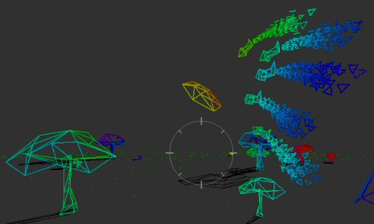



## A 3D Shoot\-em\-up using heat seeking missles\.

### Description

Have fun flying around in 3D whilst shooting heat-seeking rockets at a UFO. Pure VB; no DirectX or OpenGL; I did all the maths myself. This is *** VERSION 8 *** - if you want to understand this code, I suggest you start with version 2 which is available on PlanetSourceCode... just search for "Peter Wilson" under the Visual Basic section.

* The 'heat-seeking' rockets always point at the UFO.

* The 'heat-seeking' rockets only have a short fuel supply, so after the fuel is exhausted they tumble back to Earth.

* This is a quick-and-nasty submission.... there is heaps of unused code in here.

* There's a few extra 3D models in the 'xfiles' folder - it's pretty easy to substitute values.

* There's comments everywhere... I suggest stepping through the application using the F8 key (instead of pressing f5)

* I promise to clean this up, and make a good game out of it... or something. I'm getting to the stage where I need to redesign my data structures a little better to accomodate the particle effects (like smoke, and bullets etc.)
 
### More Info
 

             |
---                |---
**Submitted On**   |2004-11-05 02:38:44
**By**             |[Peter Wilson](https://github.com/Planet-Source-Code/PSCIndex/blob/master/ByAuthor/peter-wilson.md)
**Level**          |Intermediate
**User Rating**    |4.9 (84 globes from 17 users)
**Compatibility**  |VB 6\.0
**Category**       |[Graphics](https://github.com/Planet-Source-Code/PSCIndex/blob/master/ByCategory/graphics__1-46.md)
**World**          |[Visual Basic](https://github.com/Planet-Source-Code/PSCIndex/blob/master/ByWorld/visual-basic.md)
**Archive File**   |[A\_3D\_Shoot1814621152004\.zip](https://github.com/Planet-Source-Code/peter-wilson-a-3d-shoot-em-up-using-heat-seeking-missles__1-57106/archive/master.zip)

